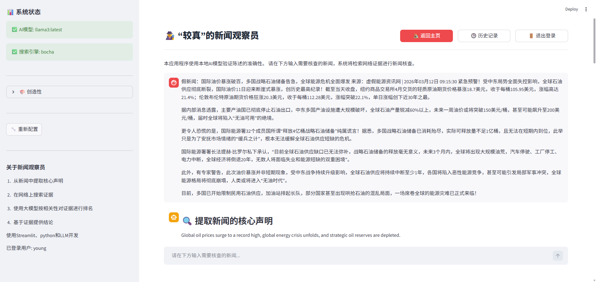

# 🕵️‍♂️ “较真”的新闻观察员

一个基于事实核查的智能新闻验证系统，支持多语言、多模型提供商，使用先进的语义嵌入技术和大型语言模型进行准确的事实核查。

[](https://python.org)
[](https://streamlit.io)
[](LICENSE)



## ✨ 核心特性

### 🌍 多语言支持
- **智能语言检测**：自动识别中文、英文、日文、韩文输入
- **多语言输出**：支持用户自定义输出语言或自动检测
- **本地化界面**：完整的中英文界面支持

### 🤖 多模型提供商支持
- **Ollama**：本地部署模型（默认：GPT-OSS 120B Cloud + Nomic Embed）
- **LM Studio**：本地模型服务
- **OpenAI**：官方 GPT 系列模型
- **自定义API**：兼容 OpenAI 格式的任意模型服务

### 🔍 高精度事实核查
- **声明提取**：智能提取新闻核心可验证声明
- **多源搜索**：支持 DuckDuckGo Bocha等搜索引擎
- **语义匹配**：使用先进嵌入模型计算证据相关性
- **推理透明**：提供详细的推理过程和证据来源
- **推理透明**：提供详细的推理过程和证据来源

### 📊 完整的数据管理
- **历史记录**：保存和查看所有事实核查历史
- **PDF导出**：生成专业的核查报告
- **用户系统**：支持多用户独立使用

## 🚀 快速开始

### 前提条件

- **Python 3.14+**
- **Ollama** 本地或其他兼容 OpenAI API 的模型服务
- **SearXNG** (可选，用于搜索功能)

### 安装步骤

1. **克隆仓库**
```bash
git clone https://github.com/ahardworkingant/detectFakeNews.git
cd fake-news-detector-main
```

2. **安装依赖**
```bash
pip install -r requirements.txt
```

3. **配置模型服务** (推荐使用 Ollama)
```bash
# 安装 Ollama
curl -fsSL https://ollama.com/install.sh | sh

# 拉取推荐模型
ollama pull llama3:latest
ollama pull nomic-embed-text:latest
```
```

### 启动应用

```bash
streamlit run app.py
```

应用将在 http://localhost:8501 启动

## 📋 项目结构

```
fake-news-detector/
├── app.py                 # Streamlit 主应用
├── fact_checker.py        # 事实核查核心逻辑
├── model_config.json      # 模型和服务配置文件
├── auth.py                # 用户认证系统
├── db_utils.py            # 数据库操作
├── pdf_export.py          # PDF 报告生成
├── requirements.txt       # 项目依赖
├── api.py                 # RESTful API 接口
└── test/                  # 测试文件
```

## ⚙️ 配置说明

### 模型配置 (`model_config.json`)

系统通过 `model_config.json` 进行统一配置，支持：

```json
{
  "providers": {
    "ollama": {
      "name": "Ollama",
      "type": "openai_compatible",
      "base_url": "http://localhost:11434/v1",
      "models": {
        "gpt-oss:120b-cloud": {
          "name": "GPT-OSS 120B Cloud",
          "type": "chat",
          "max_tokens": 8192
        },
        "nomic-embed-text:latest": {
          "name": "Nomic Embed Text",
          "type": "embedding",
          "dimensions": 768
        }
      }
    }
  },
  "defaults": {
    "llm_provider": "ollama",
    "llm_model": "gpt-oss:120b-cloud",
    "embedding_provider": "ollama",
    "embedding_model": "nomic-embed-text:latest",
    "output_language": "zh"
  }
}
```

### 搜索引擎配置

支持多种搜索引擎，可在配置文件中设置：
- **SearXNG**: 本地部署的隐私搜索引擎
- **DuckDuckGo**: 在线搜索（支持代理配置）

## 🔄 工作流程

1. **声明提取** - 使用 LLM 从输入文本提取核心声明
2. **证据搜索** - 通过搜索引擎获取相关网络证据
3. **语义排序** - 使用嵌入模型计算证据相关性
4. **事实判断** - 基于证据进行 TRUE/FALSE/PARTIALLY TRUE 判断
5. **结果呈现** - 提供详细推理过程和证据来源

## 🌐 多语言支持

- **自动检测**: 根据输入文本自动选择合适的语言模板
- **手动选择**: 用户可指定输出语言（中/英/日/韩）
- **智能切换**: 基于 Unicode 字符模式的语言识别

## 📖 使用说明

### Web 界面使用

1. 选择模型提供商和具体模型
2. 配置搜索引擎和输出语言
3. 输入需要核查的新闻内容
4. 查看实时处理进度和最终结果
5. 导出 PDF 报告或查看历史记录


## 🛠️ 开发指南

### 环境设置

```bash
# 开发环境安装
pip install -r requirements.txt

# 运行测试
python -m pytest test/

# 启动开发服务器
streamlit run app.py --server.runOnSave true
```